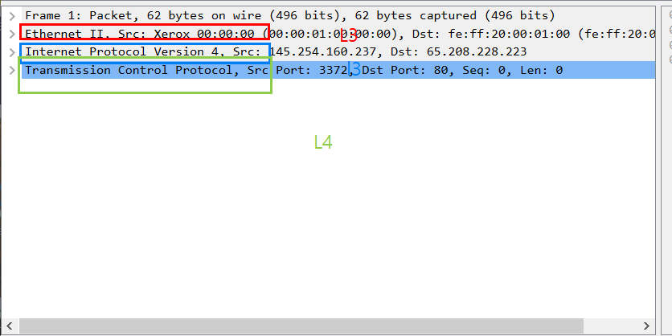

# 📅 TIL: 2026-02-02

## 📝 1. 오늘의 학습 주제 및 핵심 내용
- **주요 주제: 김호진 강사님 네트워크 총정리** 
- **핵심 개념 1: Wireshark**
    🔍 Wireshark 패킷 분석 실습 정리
1. 기본 사용법
패킷 수집: 프로그램을 실행하고 현재 통신 중인 어댑터(이더넷/Wi-Fi)를 선택하면 실시간 트래픽 수집 시작.

패킷 분석: 수집된 패킷 리스트 중 하나를 더블클릭하면 L2(Ethernet), L3(IP), L4(TCP/UDP) 계층별 상세 헤더 확인 가능.

2. 필터링(Display Filter) 필수 명령어
원하는 패킷만 걸러낼 때 사용해. &&는 "그리고", ||는 "또는"이라는 점 잊지 마.

IP 주소 검색

ip.addr == [IP] : 출발지나 목적지에 해당 IP가 포함된 모든 패킷

ip.src == [IP] : 특정 출발지(Source)만 검색

ip.dst == [IP] : 특정 목적지(Destination)만 검색

포트 및 프로토콜 검색

tcp.port == 80 : HTTP 통신 확인

udp.port == 53 : DNS 통신 확인

tcp.dstport == 443 : HTTPS 목적지 패킷만 확인

복합 필터 예시

ip.src == 1.1.1.1 || ip.src == 2.2.2.2 : 두 IP 중 하나라도 해당하면 출력

dns && udp : DNS 프로토콜이면서 UDP인 것만 출력

3. IP 헤더(L3) 주요 필드 분석
네트워크 계층에서 패킷이 어떻게 조작되고 전달되는지 보여주는 핵심 지표야.

Identification: 패킷의 식별 번호. 단편화된 패킷들이 원래 하나였다는 걸 알 수 있게 해줌.

IP Flags (단편화 유무):

DF (Don't Fragment): 1이면 "쪼개지 마", 0이면 "쪼개도 돼".

MF (More Fragments): 1이면 "뒤에 조각 더 있어", 0이면 "내가 마지막 조각이야".

Fragment Offset: 조각난 데이터의 순서를 맞추기 위한 위치 값 (정상은 0).

TTL (Time To Live): 패킷의 수명. L3 장비(라우터)를 거칠 때마다 1씩 감소하며 0이 되면 소멸.

Windows: 128 / Linux: 64 / Cisco: 255 내외에서 시작.

Protocol: 상위 계층(L4)이 무엇인지 알려줌 (1: ICMP, 6: TCP, 17: UDP).

Header Checksum: 전송 중 헤더가 깨졌는지 오류 체크.

4. ARP(Address Resolution Protocol) 상세
IP 주소를 가지고 MAC 주소를 알아내기 위해 사용해. 보안 기사 실기 단골 문제니 꼭 외워둬.

주요 타입:

Hardware Type: 1 (Ethernet)

Protocol Type: 0x0800 (IPv4)

Hardware/Protocol Length: 6 byte(MAC) / 4 byte(IP)

Opcode (동작 모드):

1 (ARP Request): "이 IP 가진 사람 누구야?" → 브로드캐스트 (FF:FF:FF:FF:FF:FF)

2 (ARP Reply): "나야, 내 MAC은 이거야" → 유니캐스트 (1:1 전달)

3/4: RARP 요청/응답 (IP를 모를 때 사용, 현재는 거의 안 씀)

💡 분석 포인트:

ARP 요청 패킷의 목적지 MAC은 항상 Broadcast 주소인 점 확인.

공격자가 잘못된 MAC 주소를 보내는 것이 바로 ARP Spoofing의 시작점임.
    

- **핵심 개념 2:OSI 7계층 복습** 
    - 
- **핵심 개념 3:네트워크 통신**
- 같은 네트워크 내에서의 통신 (L2 통신)
      같은 네트워크(동일 서브넷) 내에서는 IP 주소보다 **MAC 주소(물리 주소)**
      동작 방식: 데이터를 보내려는 기기는 상대방의 IP가 나와 같은 네트워크인지 확인합니다.
      ARP 과정: 상대방의 MAC 주소를 모른다면, ARP(Address Resolution Protocol) 요청을 보낸다.
    - 직접 전달: MAC 주소를 알아내면 스위치를 통해 해당 기기로 데이터를 직접 보낸다. 
    - 이때는 라우터(게이트웨이)를 거치지 않는다.

- 다른 네트워크와의 통신 (L3 라우팅)
    - 목적지 IP가 내 네트워크 범위를 벗어나면, 기기는 **"게이트웨이"**에게 맡긴다.
    - IP 주소 (L3): 출발지 IP는 여전히 내 컴퓨터의 IP이고, 목적지 IP는 최종 서버의 IP이다. 
    - MAC 주소 (L2): 데이터가 내 컴퓨터를 떠날 때, 목적지 MAC 주소는 최종 서버가 아니라 **'게이트웨이(라우터)의 MAC 주소'**로 적힌다.
    - 즉, IP는 최종 목적지를 가리키고, MAC 주소는 다음 게이트웨이를 가리킨다.

    - 라우팅 테이블의 역할
    - 라우터는 패킷을 받으면 자신의 라우팅 테이블을 확인합니다.
    - "이 목적지 IP로 가려면 어느 쪽 길(인터페이스)로 내보내야 하지?"를 결정한다.
    - 다음 라우터(Next Hop)를 찾으면, 다시 MAC 주소를 그 다음 라우터의 것으로 갈아 끼워 전달.   

---

## 💻 2. 실습 및 구현 내용
### ✅ 실습 목표
- 

### 🛠️ 구현 결과
 

### ✨ 새롭게 알게 된 점
- 단순히 패킷 번호인 줄 알았던 Identification(ID) 필드가 보안 분석에서 왜 중요한지 알게 됨!

- 단편화 패킷 재조립의 열쇠: 수만 개의 패킷이 섞여 있어도 ip.id == 0x1234처럼 특정 ID를       필터링하면, 하나의 거대한 파일에서 쪼개진 조각들만 정확히 분류할 수 있음.

- OS 핑거프린팅: Windows는 보통 ID를 1씩 순차적으로 증가시키고, Linux는 무작위로 생성하는 경향이 있음. 이 패턴을 분석하면 상대방의 OS를 유추할 수 있음.

- 보안 공격 탐지: ID는 같은데 Fragment Offset이 비정상적으로 겹친다면, 시스템을 마비시키는 Teardrop 공격 같은 IP 파편화 공격을 시도 중인 것으로 판단할 수 있음.

-   정보보안 시험을 준비하면서 실습을 통해서 배운 이론들이 생각이 나서 더욱 깊어진 느낌이었다 
---

## 🛠️ 3. 트러블슈팅 (Troubleshooting)
### 🔍 문제 발생 (Issue)
- **상황:** 
- **에러 메시지:** `Error`

### 💡 원인 분석 (Cause)
- 

### 🚀 해결 방법 (Solution)
- 

---

## 🧐 4. 오늘의 회고
### 💡 성찰 및 성장
- **습득 지식:** 
- **협업/소통:** 

### 🚀 Action Plan
- **부족한 점:** 
- **개선 방안:** 
- **내일의 목표:** 

---

## 📊 5. 메타인지 측정
### 🎯 오늘의 학습 점수
- **자기 객관화 점수:** ⭐ 7/10
- **이유: 인프라 보안교육 시작 전에 이론책들을 머리에 안 들어와도 무작정 읽을 보람을 느꼈다** 

---

### 🤝 공유 및 토론
- **참고 자료:** 
- **궁금한 점:** 