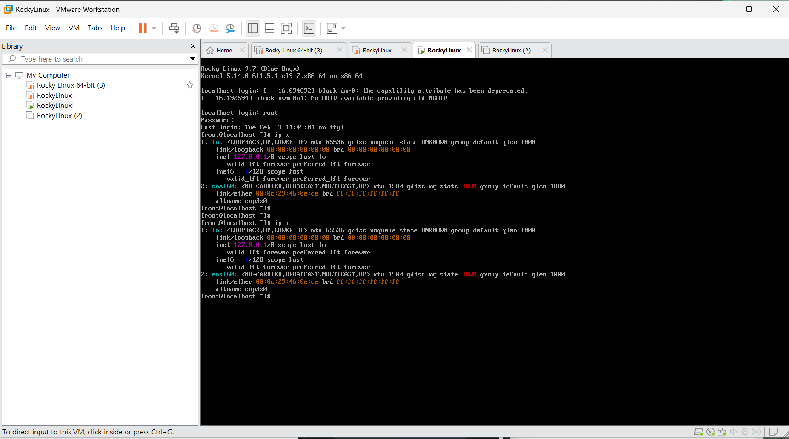

# 📅 TIL: 2026-02-03

## 📝 1. 오늘의 학습 주제 및 핵심 내용
- **주요 주제:** 네트워크 헤더 설명 및 리눅스 실습(명령어)
- **핵심 개념 1:헤더 설명** 
- 네트워크 기초 (TCP/UDP/ICMP)
    - TCP (Transmission Control Protocol)
    - 특징: 연결 지향적, 신뢰성 있는 데이터 전송.
    - 4-Way Handshake: 연결 종료 과정.
    - Client → Server: FIN, ACK (나 끝낼게)
    - Server → Client: ACK (알았어, 확인)
    - Server → Client: FIN, ACK (나도 준비됐어, 끝낼게)
    - Client → Server: ACK (응, 확인했어)
- 신뢰성 보장 원리:
    - Sequence Number: 데이터 순서 번호. 데이터가 섞이지 않게 함.
    - Acknowledgment Number (ACK): "다음번에 이 번호의 데이터를 보내줘"라는 기대값.
    - Next Seq == Recv ACK 면 통신 성공으로 간주.

- Flow Control (흐름 제어):
    - Window Size: 수신자가 받을 수 있는 여유 공간을 송신자에게 알려주어 속도를 조절함.
    - Checksum: 데이터가 전송 중 깨졌는지 오류 체크.
    - ICMP (Internet Control Message Protocol)
    - IP 프로토콜의 약점을 보완하기 위한 메시지 (오류 보고, 질의).
    - Type 8: Echo Request (핑 요청)
    - Type 0: Echo Reply (핑 응답)

- DNS 및 DHCP
    - DNS (Domain Name System)
    - 도메인: google.com처럼 컴퓨터를 식별하는 이름.

    - URL: https://www.google.com/search... 전체 경로. 도메인은 URL의 일부분임.

- FQDN (Fully Qualified Domain Name): 호스트명과 도메인명이 합쳐진 전체 이름 (예: www.naver.com).

- nslookup: 도메인 정보를 조회하는 명령어.

- DHCP (Dynamic Host Configuration Protocol)
    - IP 주소를 자동으로 할당해주는 프로토콜. PC를 켜면 네트워크 설정을 자동으로 받아옴.
- **핵심 개념 2: 리눅스 명령어 및 디렉터리 종류**
3. 리눅스 기본 사용법 (Rocky Linux 9)
- 주요 단축키
    - Ctrl + C: 현재 실행 중인 프로세스 강제 종료.

    - Ctrl + L: 화면 깨끗이 지우기 (clear와 동일).

    - Ctrl + D: 세션 종료 (exit와 동일).

    - Ctrl + U: 입력한 라인 전체 삭제.

- 기본 명령어 구조: 명령 [옵션] [인수]
    - date: 현재 날짜와 시간.
    - cal [월] [연도]: 달력 보기.
    - uname -a: 커널 및 시스템 전체 정보 출력.
    - which [명령어]: 해당 명령어 파일의 경로 확인.
    - whatis [명령어]: 명령어에 대한 짧은 설명.

- 도움말 활용 (Manual)
    - man [명령어]: 상세 매뉴얼 확인.
    - man 1: 일반 명령어.
    - man 5: 설정 파일 형식.
    - man 8: 시스템 관리 명령어.
    - man -k [키워드]: 해당 키워드가 포함된 모든 메뉴얼 검색.

- 파일 및 디렉터리 관리
    - 파일의 종류 (ls -l 맨 앞 글자)
    - -: 일반 파일
    - d: 디렉터리
    - l: 심볼릭 링크 (윈도우의 바로가기)
    - s: 소켓 (양방향 통신용)
    - p: 파이프 (단방향 통신용)
    - b/c: 장치 파일 (블록/문자)
    - ls (List) 명령어 옵션
    - ls -l: 상세 정보 표시 (권한, 소유자, 크기 등).
    - ls -a: 숨겨진 파일(.) 포함 모두 표시.
    - ls -F: 파일 형식 표시 (/ 디렉터리, * 실행파일, @ 링크).
    - ls -ld: 디렉터리 자체의 정보를 확인.

- 경로 이동
    - 절대경로: 루트(/) 기준 전체 경로 (예: /var/log).
    - 상대경로: 현재 위치(.) 기준 경로 (예: ../etc).
    - cd ~: 홈 디렉터리로 이동.
    - cd -: 이전 작업 디렉터리로 이동.

- **핵심 개념 3:** 

---

## 💻 2. 실습 및 구현 내용
### ✅ 실습 목표

- 

### 🛠️ 구현 결과
```language
// 코드를 입력하세요
```

### ✨ 새롭게 알게 된 점
- 록키리눅스 명령어가 도중에 입력이 안되는 경우가 생겼다. 
- 엔터 키를 아무리 눌러봐도 안되었는데 
- ctrl + c : 프로세스 강제종료를 활용을 했다 
- 참고한 구글 블로그에서는 ctrl + l도 알려주었는데 
- 커맨드 라인을 전부 지워주는 명령어였다 

---ㄴ

## 🛠️ 3. 트러블슈팅 (Troubleshooting)
### 🔍 문제 발생 (Issue)

- **상황:** 록키리눅스 명령어가 도중에 입력이 안되는 경우가 생겼다.
- **에러 메시지:** `Error`

### 💡 원인 분석 (Cause)
- 프로세스가 점유중일 떄는 어떠한 명령어도 듣지 않는다. 
- 처음에는 노트북 성능에 문제가 있을까 싶었는데. 
- 구글링을 통해서 알아보니 위에서 얘기한 문제점이 발견되었다

### 🚀 해결 방법 (Solution)
- 엔터 키를 아무리 눌러봐도 안되었는데 
- ctrl + c : 프로세스 강제종료를 활용을 했다 
- 참고한 구글 블로그에서는 ctrl + l도 알려주었는데 
- 커맨드 라인을 전부 지워주는 명령어였다 
 

---

- **🧐 4. 오늘의 회고**
-**성찰 및 성장**
    - 습득 지식: TCP/UDP/ICMP의 차이점과 리눅스 기본 명령어 체계를 익혔다. 특히 TCP의 3/4-Way Handshake 원리를 배우면서 통신의 신뢰성이 어떻게 유지되는지 이해하게 된 게 큰 수확이다.

    - 협업/소통: 강사님이 설명해주신 DNS와 URL의 차이점을 동료들과 공유하며 개념을 다시 정리했다. 모르는 부분이 생겼을 때 구글링과 질문을 병행하며 해결하는 습관을 들이고 있다.

- **🚀 Action Plan**
- 부족한 점: 리눅스 디렉터리 구조(etc, var, proc 등)와 각 경로의 세부 용도가 아직은 헷갈린다.

- **개선 방안**: 자주 사용하는 핵심 디렉터리 위주로 직접 접속해보고 ls -l로 내부 파일을 확인하며 익숙해질 예정이다.

 - 내일의 목표: 오늘 배운 리눅스 파일 시스템 권한(Permission) 개념을 확실히 복습하고 실습에 적용해보기.

- **📊 5. 메타인지 측정**
- **🎯 오늘의 학습 점수**
- **자기 객관화 점수: ⭐ 8/10** 최고점이다

- 이유: 네트워크 헤더의 이론적인 부분부터 리눅스 실무 명령어까지 전반적으로 흐름을 놓치지 않고 따라갔다. 특히 명령어 입력 불가 상황을 스스로 해결하며 실무 대응 능력을 키운 점에 높은 점수를 주었다.

- **🤝 공유 및 토론**
참고 자료: Rocky Linux 공식 문서, 유데미(Udemy) 네트워크 기초 강의

궁금한 점: TCP의 Window Size가 실시간으로 변할 때 네트워크 환경에 따라 효율이 얼마나 차이 나는지 구체적인 사례가 궁금하다.