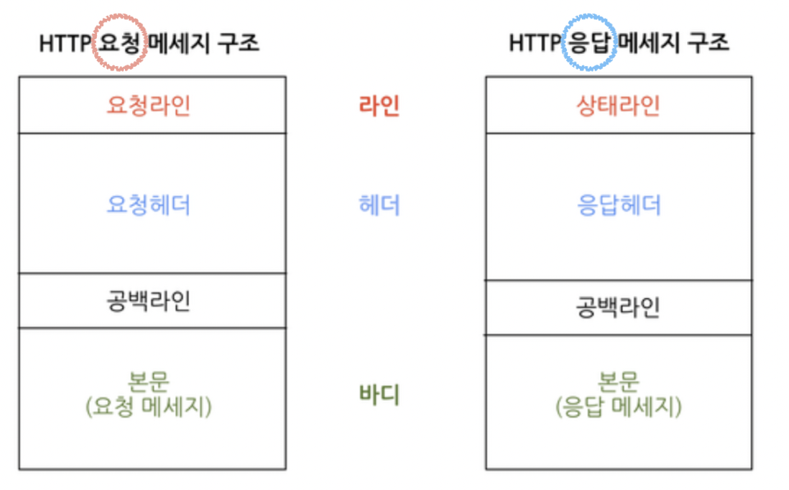

# 📅 TIL: 2026-02-07

# 🌐 HTTP 프로토콜 핵심 정리 (정보보안산업기사 대비)

## 1. 비상태성 (Stateless)
HTTP의 가장 대표적인 특징으로, 서버가 클라이언트의 이전 상태를 보관하지 않는 설계 원칙입니다.

* **개념:** 서버는 각 요청을 독립적인 트랜잭션으로 취급하며, 과거의 요청이나 응답 데이터를 기억하지 않음.
* **장점:** * 서버의 응답 독립성 확보.
    * 서버 자원 소모가 적고 확장성(Scalability)이 뛰어남 (Stateless하므로 서버를 여러 대 늘려도 대응이 쉬움).
* **단점:** 로그인 유지, 장바구니 등의 기능 구현이 불가능함.
* **보완:** **쿠키(Cookie)**, **세션(Session)**, **토큰(JWT)** 등을 활용하여 상태를 유지함.

---

## 2. 비연결성 (Connectionless) & 영속적 연결 (Persistent Connection)

### ① 비연결성 (Connectionless)
* **특징:** 클라이언트가 요청을 보내고 서버가 응답을 마치면 즉시 TCP 연결을 끊는 방식.
* **한계:** 웹 페이지의 수많은 요소(이미지, CSS 등)를 가져올 때마다 TCP 3-Way Handshake를 반복해야 함 (오버헤드 발생).

### ② 영속적 연결 (Persistent Connection / HTTP 1.1)
* **개념:** 한 번 맺은 TCP 연결을 끊지 않고, 일정 시간 동안 유지하며 여러 개의 요청/응답을 처리하는 방식.
* **Keep-Alive:** 헤더를 통해 연결 유지 시간과 최대 요청 개수를 설정함.
* **장점:** * 네트워크 성능 향상 (3-Way Handshake 횟수 감소).
    * CPU 및 메모리 자원 절약.
    * 지연 시간(Latency) 감소.
---

## 3. 핵심 체크포인트 (보안 엔지니어 관점)

> **"왜 HTTP는 신뢰성 있는 TCP를 쓰면서도 Stateless 할까?"**

1.  **계층의 분리:** * **전송 계층(L4):** **TCP**를 사용하여 패킷의 유실 없는 '신뢰성 있는 전송'에 집중.
    * **응용 계층(L7):** **HTTP**를 사용하여 서버가 클라이언트를 기억해야 하는 부담 없이 '빠른 서비스 제공'에 집중.
2.  **보안적 시사점:** * HTTP가 Stateless하기 때문에 발생하는 취약점이 바로 **세션 관리 취약점**이다.
    * 해커가 세션 ID를 탈취하면 서버는 "이 사람이 아까 그 사람인가?"를 세션 ID로만 판단하므로 **세션 하이재킹(Session Hijacking)** 공격에 노출됩니다.

---

# 📨 HTTP 요청(Request) 및 응답(Response) 메시지 구조

HTTP 메시지는 사람이 읽을 수 있는 텍스트 형식이지만, 보안 측면에서는 각 필드에 공격 코드(SQL Injection, XSS 등)가 삽입될 수 있어 구조를 정확히 아는 것이 중요합니다.

---

## 1. HTTP 요청 메시지 (Request Message)

클라이언트(브라우저)가 서버에 자원을 요청할 때 보내는 메시지입니다.

### 📝 주요 특징 및 구성
1. **Start Line (Request Line):**
   * **Method:** 수행할 작업 (GET, POST, PUT, DELETE 등).
   * **Target:** 요청하는 경로 (예: `/index.html`).
   * **Version:** HTTP 버전 (예: `HTTP/1.1`).
2. **Request Headers:**
   * **Host:** 요청을 보내는 서버의 도메인 성함 (필수).
   * **User-Agent:** 클라이언트의 브라우저 및 OS 정보 (보안 점검 시 공격 도구 식별에 활용).
   * **Cookie:** 서버로부터 받은 세션 ID 등을 다시 전달하여 상태 유지.
3. **Empty Line:** 헤더와 바디를 구분하는 빈 줄 (매우 중요!).
4. **Message Body:**
   * GET 방식은 비어 있으며, POST/PUT 방식에서 사용자가 입력한 데이터(JSON, Form 데이터 등)가 들어감.

---

## 2. HTTP 응답 메시지 (Response Message)

서버가 클라이언트의 요청을 처리한 결과를 돌려주는 메시지입니다.

### 📝 주요 특징 및 구성
1. **Status Line:**
   * **Version:** HTTP 버전.
   * **Status Code:** 처리 결과 상태 코드 (예: `200 OK`, `404 Not Found`, `500 Error`).
2. **Response Headers:**
   * **Content-Type:** 바디에 담긴 데이터의 종류 (예: `text/html`, `application/json`).
   * **Set-Cookie:** 서버가 클라이언트에게 "이 쿠키를 저장해!"라고 명령 (세션 ID 발급 시 사용).
   * **Server:** 사용 중인 웹 서버 소프트웨어 정보 (보안을 위해 보통 숨김 처리 권장).
3. **Empty Line:** 헤더와 바디 구분.
4. **Message Body:**
   * 실제 HTML 코드, 이미지 데이터, JSON 데이터 등 사용자에게 보여줄 실질적 내용.

---

## 💡 정보보안산업기사 암기 팁
* **요청과 응답의 공통점:** `Header - Empty Line - Body` 구조는 동일하다.
* **차이점:** 요청은 첫 줄에 **Method**가 오고, 응답은 첫 줄에 **Status Code**가 온다.
* **빈 줄(Empty Line)의 의미:** HTTP 메시지 파싱의 경계선이다. 만약 이 경계가 모호하면 **HTTP Response Splitting** 같은 보안 취약점이 발생할 수 있다.

## 🛠️ 트러블슈팅 및 회고
* **상황:** "HTTP는 TCP 기반이니까 당연히 상태를 기억(Stateful)하겠지?"라고 착각함.
* **교훈:** TCP는 **'연결(Connection)'**을 담당하는 것이고, HTTP는 그 연결 위에서 **'데이터의 의미와 기억(State)'**을 담당하는 것이다. 
* **나의 설계 반영:** 요양원 프로젝트에서 로그인 기능을 만들 때, HTTP의 Stateless한 단점을 보완하기 위해 세션(Session) 타임아웃을 30분으로 설정하고, 쿠키에 HttpOnly 설정을 부여하여 보안을 강화해야겠다.

