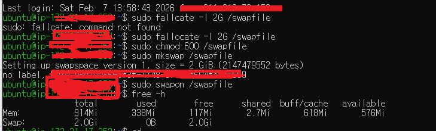

**은영 프로젝트 일지 2026-02-08**

- 은영 프로젝트 변경사항 
- 메인 페이지 html 수정 

# 문제 상황 
프로젝트 작업을 진행하던 중, ./gradlew build 명령어를 실행하면 프로세스가 완료되지 않고 한참 동안 멈춰 있는 현상이 발생했습니다. 별다른 에러 메시지 없이 빌드가 무한 루프에 빠진 듯한 상태가 지속되었습니다.

# 원인 파악 
문제의 원인을 찾던 중, 현재 사용 중인 AWS EC2 프리티어(t2.micro) 인스턴스의 하드웨어 스펙에 주목했습니다.

메모리 제한: 프리티어 인스턴스는 단 1GB의 RAM만을 제공합니다.

리소스 고갈: Gradle 빌드는 상당히 많은 메모리를 소모하는 작업입니다. 1GB라는 협소한 RAM 용량으로는 빌드 과정을 감당하지 못해 시스템이 'Freeze' 상태가 된 것이었습니다.

해결 방안 : SWAP 메모리 설정
이때 이스트 캠프 보안 강의 중 02-06일에 김호진 강사님이 언급하셨던 'SWAP(스왑)' 개념이 떠올랐습니다.

- **SWAP이란?** 
    - 실제 RAM 메모리가 가득 찼을 때, 하드 디스크(SSD)의 일부 공간을 메모리처럼 빌려 쓰는 기술입니다. 
    - 속도는 실제 RAM보다 느리지만, 메모리 부족으로 프로세스가 강제 종료되거나 멈추는 것을 방지할 수 있습니다.

**적용 단계:**

SSD의 일정 부분을 스왑 파일로 할당 (주로 2GB 권장).

해당 파일을 스왑 공간으로 포맷 및 활성화.

활성화 후 다시 빌드를 시도한 결과, 이전보다 속도는 조금 느릴 수 있으나 멈춤 현상 없이 성공적으로 빌드가 완료되었습니다.

**실제 코드** 

- # 소감 및 배운 점 (Retrospective)
    - 강의의 가치: 단순히 이론으로만 들었던 'SWAP' 설정을 실제 위기 상황에서 떠올려 적용해 보며, 기초 지식의 중요성을 다시 한번 체감했습니다.
    - 자원 관리의 이해: 클라우드 환경에서 제한된 리소스를 어떻게 효율적으로 관리할 수 있는지 배울 수 있었습니다.

- # 성장: 
이제는 단순히 빌드가 안 된다고 당황하는 것이 아니라, 시스템의 메트릭(메모리, CPU 등)을 먼저 살피는 습관을 지니게 되었습니다.

**[실행 명령어]**
Bash
# 1. 2GB 크기의 빈 파일 생성
sudo fallocate -l 2G /swapfile

# 2. 파일 권한 수정 (보안을 위해 소유자만 읽기/쓰기 가능)
sudo chmod 600 /swapfile

# 3. 해당 파일을 스왑 공간으로 포맷
sudo mkswap /swapfile

# 4. 스왑 공간 활성화
sudo swapon /swapfile

# 5. 설정 확인
free -h  

4. 결과 (Result)
메모리 확보: 실제 RAM 1GB + 가상 메모리(Swap) 2GB = 총 3GB 수준의 작업 공간 확보.

빌드 성공: 동일한 ./gradlew build 실행 시 멈춤 없이 100% 완료 및 BUILD SUCCESSFUL 확인.

안정성: 이후 nohup을 통한 애플리케이션 실행 시에도 안정적인 상태 유지.

