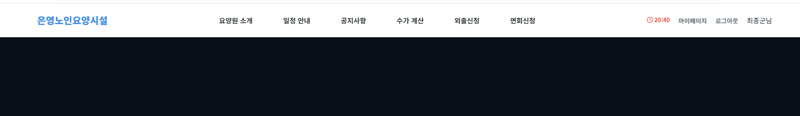

# 📅 TIL: 2026-02-16

## 📝 1. 오늘의 학습 주제 및 핵심 내용
- **주요 주제:** -2026-02-16 Project Session vs Token[Session 선택 이유]  

- **핵심 개념 1: 왜 세션인가?** 
-본 서비스는 요양시설 관리 및 가족 소통 플랫폼으로, 불특정 다수보다는 인가된 특정 사용자 중심의 서비스
- 요양원 보호자 특성상 웹 사이트 이용자는 한정된 모습을 보인다. 
- 다양한 연령층이 아닌 보호자인 경우도 대부분이 고령자 혹은 바쁜 직장인 경우가 대다수이다
- 자리를 비우거나, 로그아웃을 안 하는 경우가 대부분이다

- **핵심 개념 2: 보안의 신뢰도 우선**
- 확장성보다는 보안의 신뢰도를 우선시 했다 서버에서 사용자 상태를 직접 통제를 하는 세션 기반 인증을 채택했다
- 토큰 방식에서 발생할 수 있는 토큰 탈취 경우에는 무효화가 즉시 이루어지기는 힘들다. 
- 세션 방식 경우 서버측에서 관리하는 메모리가 증가를 하는 단점이 있지만 
- 다양한 사용자가 이용하는 웹사이트가 아닌 점을 생각을 해 세션 방식을 적용했다. 

- **핵심 개념 3: 취약점 대응: 세션 타임아웃(Session Timeout) 도입**
- 세션 방식도 취약점이 없는 건 아니다. 
- 세션 하이재킹과 공용 환경에서 발생할 수 있는 정보 유출 피해가 발생할 수 있다. 
- 그래서 도입을 한게 세션 타임아웃이다. 
- 사용자가 더 이상 웹페이지를 사용을 안 하는 경우 30분 뒤 자동으로 세션이 만료가 되게 만들었다 
- 이는 **공격 표면 축소** 전략도 가능하며 **리소스 최적화**도 노릴 수 있다 
- 사용자에게는 30분 타이머를 보여주고 1분 남았을 시점에는 깜빡이는 타이머를 제공해 UX를 늘렸다. 


---

## 💻 2. 실습 및 구현 내용
### ✅ 실습 목표
- 

### 🛠️ 구현 결과
```language
// 코드를 입력하세요
```

### ✨ 새롭게 알게 된 점
- 

---

## 🛠️ 3. 트러블슈팅 (Troubleshooting)
### 🔍 문제 발생 (Issue)
- **상황:** 
- **에러 메시지:** `Error`

### 💡 원인 분석 (Cause)
- 

### 🚀 해결 방법 (Solution)
- 

---

## 🧐 4. 오늘의 회고
### 💡 성찰 및 성장
- **습득 지식:** 
- **협업/소통:** 

### 🚀 Action Plan
- **부족한 점:** 
- **개선 방안:** 
- **내일의 목표:** 

---

## 📊 5. 메타인지 측정
### 🎯 오늘의 학습 점수
- **자기 객관화 점수:** ⭐ 0/10
- **이유:** 

---

### 🤝 공유 및 토론
- **참고 자료:** 
- **궁금한 점:** 