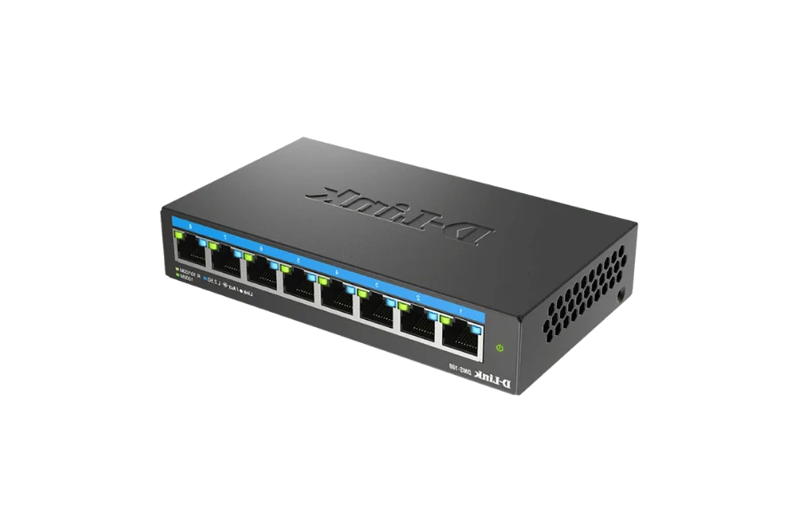

# 📅 TIL: 2026-01-31

## 📝 1. 1주차 강의 내용 정리
- **주요 주제:** __26-01-27__
- **핵심 개념 1: 기본용어** 
    - 시스템 : 네트워크 안에서 어떠한 역할을 수행하는 장치(서버,클라이언트)
    - 인터페이스 : 서로 다른 두 시스템이 대화할 수 있게 해주는 통로
    - 전송매체 : 데이터라는 전기 및 빛 신호를 전달(들어가는) 물리적인 수단(케이블, 무선_전파)
    - 프로토콜 : 전송매체를 통해서 데이터를 교환하기 위한 특정 규칙 
    - 노드 : 네트워크에 연결된 모든 지점(중간 장비(라우터, 스위치, 허브) 및 PC,스마트폰, 공유기)
    - 호스트 : 네트워크 주소(IP)를 가지고 직접 애플리케이션을 수행하는 장치  
<div></div>  

- **핵심 개념 2:** __OSI 7계층__
    - 물리계층 : 비트 사용 
    - 데이터링크 계층 : 프레임 
    - 네트워크 계층 : 패킷
    - 전송 계층 : 세크먼트 
    - 세션 계층 : 
    - 표현 계층 :  -- 메세지 --
    - 응용 계층 :   
<div></div>  

- **핵심 개념 3:** __마크다운 및 각종 도구 활용__
    - vs code와 같은 TIL 도구 추천 
---

**주요 주제:** __26-01-28__ 
- **핵심 개념 1:** 네트워크 케이블 (Physical Layer) 
    - 1. 네트워크 케이블 (Physical Layer)
    - 100BASE-T 뜻 : 100 : 전송 속도 100Mbps를 의미한다. (요즘은 1Gbps인 1000BASE-T를 많이 사용한다)
    - BASE: Baseband. 디지털 신호를 변조 없이 그대로 보내는 방식이다. (반대로 Broadband는 아날로그로 변조해서 여러 채널로 보낸다.)
    - T: Twisted Pair. 우리가 흔히 말하는 __'랜선(UTP/STP)'__

    - __케이블의 종류__  

    - 동축케이블: 아날로그와 디지털을 동시에 다룰 수 있다
    - 꼬임 선 (Twisted Pair): 노이즈(간섭)을 억제하기 위해 사용  
    - 모터 같은 기계에서 발생하는 자기장 간섭을 상쇄하기 위해.  

      

__제미나이 tip.__
    STP vs UTP: 그냥 꼬기만 하면 UTP, 겉에 은박지 같은 '차폐막'을 씌우면 STP야. 
    노이즈가 심한 공장이나 서버실에선 STP가 필수겠지?

__Straight vs Cross__
Straight Through: PC(3계층)와 스위치(2계층)처럼 서로 다른 계층을 연결할 때.
Cross Over: PC와 PC, 스위치와 스위치처럼 혹은 라우터와 라우터 같은 계층을 연결할 때 사용.

이유: Tx와 Rx를 교차해서 사용을 한다 핀이 겹치면 안되니까.

Auto-MDI-X: 자동으로 핀을 인식해준다.
  
  ---  


- __STP (Spanning Tree Protocol)__ 스위치(2_계층)

    - 루핑(Looping)이란? : 네트워크 상에서 목적지를 찾지 못하고 무한히 도는 현상
    - 고가용성(HA) : 선 하나가 끊겨도 인터넷이 끊기지 않게 두 개 연결한다__(이중화)__ 
    - 브로드캐스트 스톰(Broadcast storm) : 선 두개를 연결하면 무한 루프에 빠진다.
    - __STP 역할__ :  Blocking : 논리적으로 막았다가 한 쪽 선에서 문제가 발생하면 다른 쪽을 연결시킨다.  
    <div></div>  
---  

**핵심 개념 2: 네트워크 종류 및 범위**  

- NFC (Near Field Communication) - 초근거리 범위: 10cm 이내 스마트폰 삼성페이, 교통카드 태그  
- LAN (Local Area Network) - 근거리 범위: 집, 사무실, 강의실
- CAN (Campus Area Network) - 캠퍼스 범위: 대학교 부지, 군부대, 기업 단지
-  MAN (Metropolitan Area Network) - 도시범위 통신사가 도시 인프라를 구축할 때 사용하는 개념.
- WAN (Wide Area Network) - 광대역 범위: 국가, 대륙, 지구 전체
<div></div>

- **핵심 개념 3:** 네트워크 장비
  

  

- __허브__  (물리 계층)
    - LAN에서 여러 컴퓨터를 연결하는 하드웨어이다. 
    - 의도된 수신자인지 여부를 따지지 않고 모든 연결된 장치로 전송을 한다
    - 데이터 필터링을 수행하지 않아 허브에 연결된 모든 장치가 직접 네트워크 트래픽을 처리하게 된다. 

    __매우 비효율적__ 
--- 
- __스위치__ 
    - 스위치는 각 패킷의 대상 주소를 결정하고 이를 기반으로 올바른 포트로만 데이터를 전달한다. 이 방법은 네트워크 트래픽과 데이터 충돌 가능성을 크게 줄일 수 있다. 
    
    - 데이터 충돌은 동일한 장치 간에 동시에 여러 데이터 신호가 전송될 때 발생하며 대규모 네트워크에 더 효율적이다.

    - 네트워크의 장치의 소스 MAC, 포트 번호, 소스 IP 주소를 포함하는 MAC 데이터베이스를 유지 관리한다. 스위치가 데이터 패킷을 받으면 __MAC 테이블__ 에서 해당 값을 찾으려고 한다. 먼저 대상 주소가 알려져 있는지 확인합니다. 그렇다면 __MAC 테이블__ 에서 지정된 스위치 포트를 가져온다. 그렇지 않으면 플러드를 보냅니다. __소스 주소가 이미 알려진 경우 소스 MAC에 해당하는 소스 포트가 사용된다.__ 이를 스위치가 학습(Learning)과 포워딩(Forwarding) 기능을 하기 때문이다. 
    
- ### ✨ 새롭게 알게 된 점 - 1월 30일 실습을 통해서 알아냄
    - 패킷 트레이서 실습을 할 때 웹브라우저에 들어갈 때 DNS서버와 연결이 될 때   
    처음에는 ARP 패킷이 해당 DNS 서버의 MAC(물리적) 주소를 찾기 위해 송신 되었다.   
    그 다음에는 DNS 패킷이 전송되는 방식이었는데 두 번째 실행을 했을 시 APR 패킷이 아닌   
    위에서 설명한 MAC 테이블과 ARP 캐시가 이미 상대방의 주소를 저장하고 있어서   
    두 번째 실행에서는 바로 DNS 패킷이 송신된다. 
    -  추가적으로 스위치가 수신자를 찾기위해서 해당 브로드캐스트 주소로 데이터를 뿌리는 용어를 __flood(플러드)__ or __flooding__ 라고한다.

  <div></div>

 __중요 : 스위치가 플러딩(Flooding)을 하는 경우__
- 1. 목적지 주소를 모를 때 (Unknown Unicast) 스위치의 MAC 주소 테이블에 목적지 MAC 주소가 없을 때.
- 2. 브로드캐스트 패킷일 때 (Broadcast) 목적지 주소가 FF:FF:FF:FF:FF:FF로 설정된 패킷(예: ARP Request)을 받았을 때.
- 3. 멀티캐스트 패킷일 때 (Multicast)


- __라우터__ 
    - 라우터는 두 개 이상의 네트워크를 연결할 수 있으며 __(게이트웨이)__ , 네트워크 간의 트래픽을 지시하는 역할을 한다. 효율적인 데이터 전송을 위해 라우터는 어떤 데이터 패킷을 네트워크의 어느 부분으로 보내야 하는지 알아야 하며, 여기서 IP 주소가 유용하다. 라우터가 데이터 패킷을 보내는 가장 좋은 방법을 결정하는 데 도움이 되므로 인터넷 연결 및 기타 복잡한 네트워크에 필수적인 장치.

**주요 주제:** __26-01-29__ 
- **핵심 개념 1:** 
- **핵심 개념 2:** 
- **핵심 개념 3:** 

---


- **핵심 개념 1:** 
- **핵심 개념 2:** 
- **핵심 개념 3:** 


---

- **핵심 개념 1:** 
- **핵심 개념 2:** 
- **핵심 개념 3:** 

---

## 💻 2. 실습 및 구현 내용
### ✅ 실습 목표
- 

### 🛠️ 구현 결과
```language
// 코드를 입력하세요
```

### ✨ 새롭게 알게 된 점
- 

---

## 🛠️ 3. 트러블슈팅 (Troubleshooting)
### 🔍 문제 발생 (Issue)
- **상황:** 
- **에러 메시지:** `Error`

### 💡 원인 분석 (Cause)
- 

### 🚀 해결 방법 (Solution)
- 

---

## 🧐 4. 오늘의 회고
### 💡 성찰 및 성장
- **습득 지식:** 
- **협업/소통:** 

### 🚀 Action Plan
- **부족한 점:** 
- **개선 방안:** 
- **내일의 목표:** 

---

## 📊 5. 메타인지 측정
### 🎯 오늘의 학습 점수
- **자기 객관화 점수:** ⭐ 0/10
- **이유:** 

---

### 🤝 공유 및 토론
- **참고 자료:** 
- **궁금한 점:** 