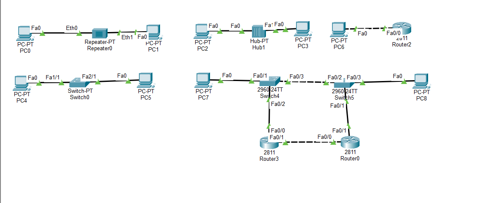

# 📅 TIL: 2026-01-28

## 📝 1. 오늘의 학습 주제 및 핵심 내용
- **주요 주제:** 네트워크 이론

핵심 개념 1: OSI 7계층 이해하기

1계층 물리 계층(비트) - 시스템은 케이블을 통해서 전기적 신호를 받는다. 단순 (0과 1)

2계층 데이터링크(프레임) - nic가 받은 전기적 신호를 컴퓨터가 해석할 수 있는 프레임단위로 바꾼다 + MAC(물리적) 주소를 데이터에 추가한다 전기적 신호에서 오류를 검출하고 흐름을 제어한다.   

3계층 네트워크 계층(패킷) - 네트워크 계층은 IP로 데이터를 보낸다. 시스템과 시스템 즉 호스트와 호스트 간에 경로를 찾는다(라우팅 알고리즘) 

4계층 전송 계층(TCP/세그먼트),(UDP/데이터그램) - 응용 프로그램 간 통신이다. 시스템을 찾아도 해당 컴퓨터에는 여러가지 응용 프로그램 중 요청에 따른 port를 찾는다.   

5계층 세션, 표현, 응용 계층(메세지) - 각 데이터를 응용 프로그램에 맞게 설정 및 유지 데이터를 실행 프로그램에 맞게 변환 과정 등을 거친다.   

**추가 내용 : TCP/IP라고 같이 묶어서 부르는 이유를 이해를 못 했다.**
- 계층이 다른데 왜 그럴까 찾아보니 IP는 오직 데이터를 전송하기만 하는 비신뢰적인 연결이다 이를 해결해주는게 신뢰적인 통신 TCP이다.   

**추가 내용 : 왜 네트워크 계층에서 MAC 주소를 필요로 하는지 이해가 안 갔다 IP도 MAC도 고유 주소라면 IP라도 충분하지 않을까**
- IP는 가변적인 주소이다, MAC는 고정적인 주소이다 인터넷은 너무나도 광활하여 고정된 MAC 주소만으로는 주소를 찾기가 불가능하다

핵심 개념 2: 네트워크 장비

**허브 (Hub)**
- 계층: 1계층 (물리 계층)
- 특징: 들어온 데이터를 연결된 모든 포트로 다 뿌려버립니다 (브로드캐스트).
- 단점: 보안에 취약하고 충돌(Collision)이 발생해 네트워크가 느려진다.
- 핵심: 단순히 전기적 신호를 복제해서 전달하는 단순 통로 역할.

**스위치 (Switch)**
- 계층: 2계층 (데이터 링크 계층)
- 특징: 각 포트에 연결된 기기의 MAC 주소를 기억(Learning)한다.
- 장점: 데이터를 필요한 목적지 포트로만 정확히 보내주며 충돌이 발생하지 않는다.
- 핵심: MAC 주소 테이블을 기반으로 데이터를 정확히 배달하는 장치.

**라우터 (Router)**
- 계층: 3계층 (네트워크 계층)
- 특징: IP 주소를 확인하여 서로 다른 네트워크 간의 길을 찾아줍니다.
- 장점: 목적지까지 가는 가장 빠른 경로를 결정(Routing)하고 보안 기능도 수행한다.
- 핵심: 서로 다른 네트워크를 연결하고 경로를 지정하는 장치.

**추가 내용 : 왜 여러 대의 스위치랑 라우터를 사용을 할까 왜 캡슐화와 역캡슐화를 반복할까**
- 그 이유는 물리적인 한계와 데이터가 이동 중 훼손을 입고 정확한 데이터를 전달하기 위해서 트래픽 분산과 병목 방지를 위해서이다.
- UTP는 최대 100m까지 데이터가 전달이 가능하다 그러한 물리적인 문제해결도 있다

**핵심 개념 3: CISCO Packet 실습**
- 간단한 실습을 진행을 하였다 크로스 오버 케이블과 스트레이트 케이블을 활용
- 각 계층에 맞는 케이블도 써보고 다른 계층 그리고 스위치와 라우터 간 연결 
- 실제로 사용하는 방식인 pc와 pc간 통신 시 사이에 있는 라우터와 스위치 간 연결

---

## 💻 2. 실습 및 구현 내용
### ✅ 실습 목표
- Cisco Packet Tracer를 활용한 네트워크 장비 간의 물리적 연결 및 인터페이스 활성화 실습

### 🛠️ 구현 결과

### ✨ 새롭게 알게 된 점
- 계층이 같은 장비(PC-Router 등)를 연결할 때 크로스 케이블을 사용해야 링크가 활성화된다는 점을 실습으로 확인함.

---

## 🛠️ 3. 트러블슈팅 (Troubleshooting)
### 🔍 문제 발생 (Issue)
- **상황:** 케이블을 올바르게 연결을 해도 라우터와 라우터, 라우터와 PC 사이에 계속 빨간색 불이 들어왔다.
- **에러 메시지:** `빨간불 (Link Down)`

### 💡 원인 분석 (Cause)
- 라우터의 포트는 보안과 관리의 이유로 기본 설정이 'off(Shutdown)' 상태이기 때문임.

### 🚀 해결 방법 (Solution)
- 해당 프로그램에서 라우터 포트 상태를 'on'으로 바꿔줬다. (CLI의 경우 `no shutdown` 명령 사용)

---

## 🧐 4. 오늘의 회고
### 💡 성찰 및 성장
- **습득 지식:** 이론 내용 습