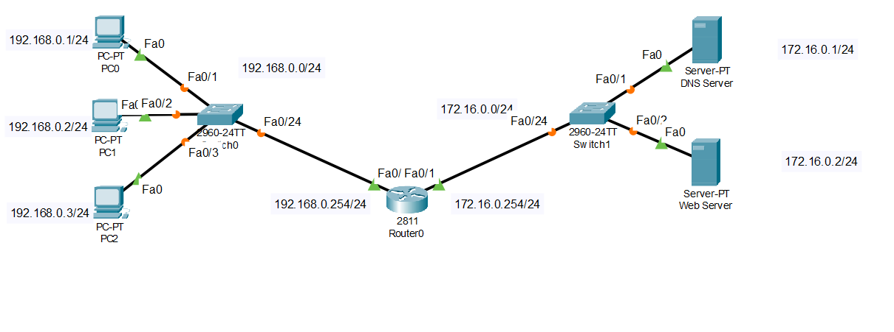

# 📅 TIL: 2026-01-30

## 📝 1. 오늘의 학습 주제 및 핵심 내용
- **주요 주제:** 장비를 통한 LAN 이동 과정 (ARP)
- **핵심 개념 1: ARP를 통한 네트워크 흐름**
    - 스위치는 MAC 테이블과 캐시를 통해서 MAC 주소를 기억하고 그 기반으로 전송을 수행한다. 
    - 새로운 주소는 APR Request를 통해서 (브로드캐스트 방식) 해당 장비를 찾는다. 
    - 찾아낸 장비는 IP 포워딩을 통해서 ARP 캐시에 저장을 하고 두 번째 요청에서는 (동일 IP에 대한)
    - ARP 패킷을 보내지 않는다. 즉 찾는 과정을 생략한다.

    - 다음 내용은 다소 주관적인 내용이라 새롭게 알게 된 점에서 풀겠습니다. 
- **핵심 개념 2:IPv4 헤더 정리** 
    - [각종 헤더 내용](./header-structure.md)

- **핵심 개념 3: TCP 헤더 정리** 
    - [TCP 내용 정리](./tcp.md)


---

## 💻 2. 실습 및 구현 내용
---


### ✅ 실습 목표
- 
- 
### 🛠️ 구현 결과



### ✨ 새롭게 알게 된 점
- 1. 가장 먼저 동일 LAN을 찾을 때는 브로드캐스트 방식으로 수신지 IP를 찾는다. 이 때 사용하는 방식은 브로드캐스트 방식이다.  
하지만 동일한 LAN이 아니라면? 라우터의 중요 특징 하나는 브로트캐스트 패킷을 차단한다.  

- 2. 다른 LAN 안에서 해당 IP를 찾는 과정 
    - 2-1 가장 먼저 IP를 확인한다 IP가 해당 LAN이 아니라면 목적지는 라우터(게이트웨이)의 MAC 주소가 된다.
    - 2-2 라우터에게 수신지 라우터의 MAC 주소를 찾게 한다. 라우터와 라우터 사이의 이동을 __Routing__ 을 통해서 라우팅 테이블을 찾는다
    - 2-3 해당 과정은 ARP가 아니라 라우팅 프로토콜을 통해서 이용이 된다(OSPF, BGP)
    - 2-4 다시 라우터를 통해 ARP 요청을 하게 된다 (발송지의 ARP 요청이 아닌 목적지 라우터 ARP 요청) 

- 3. 패킷 트레이서 실습을 할 때 웹브라우저에 들어갈 때 DNS서버에게 요청을 할 때 처음에는 ARP 패킷이 해당 DNS 서버의 MAC(물리적)주소를  
    찾기 위해 송신 되었다.   다음에는 DNS 패킷이 전송되는 방식이었는데 두 번째 실행을 했을 시 APR 패킷이 아닌  
    위에서 설명한 MAC 테이블과 ARP 캐시가 이미 상대방의 주소를 저장하고 있어서 두 번째 실행에서는 바로 DNS 패킷이 송신된다.

    __해당 과정이 되는 이유가 위에서 얘기한 MAC 목록과 캐시를 활용과 학습과 포워딩이다__ 

---

## 🛠️ 3. 트러블슈팅 (Troubleshooting)
### 🔍 문제 발생 (Issue)
상황: 마크다운 문서 하단 서식 깨짐 현상

에러 메시지: 서식 미적용 (텍스트가 코드 블록 내부에 갇힘)

### 💡 원인 분석 (Cause)
코드 블록 시작 태그(```) 후 닫는 태그가 누락되어 이후 모든 본문이 코드 블록으로 인식됨.

### 🚀 해결 방법 (Solution)
코드 블록이 끝나는 지점에 닫는 태그(```)를 정확히 추가함.
- 

---

## 🧐 4. 오늘의 회고
### 💡 성찰 및 성장  
- **습득 지식:** ARP의 작동 범위와 라우터의 게이트웨이 역할에 대한 깊이 있는 이해.
- **협업/소통:** 

### 🚀 Action Plan
- **부족한 점:** 
- **개선 방안:** 
- **내일의 목표: 네트워크 전체적인 복습(노트 필기)과 이론서를 통한 이론 공부(네트워크 보안과 응용프로그램 프로토콜)** 

---

## 📊 5. 메타인지 측정
### 🎯 오늘의 학습 점수
- **자기 객관화 점수:** ⭐ 9/10
- **이유:** 기술적 메커니즘을 실제 패킷 흐름과 연결하여 꽤나 완벽히 이해함. 스스로 만족

---

### 🤝 공유 및 토론
- **참고 자료:** 
- **궁금한 점:** 

```