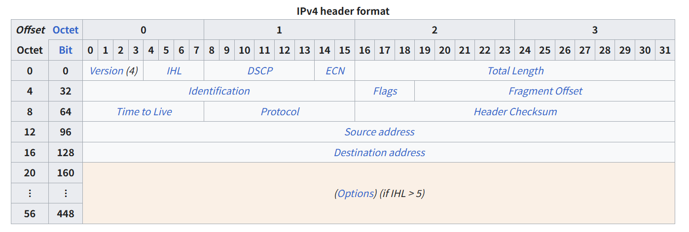

# 📅 TIL: 2026-01-31

## 📝 1. 오늘의 학습 주제 및 핵심 내용
- **주요 주제:** IPv4
    

    __IPv4 헤더의 크기와 범위__ 

    최소 크기: 20바이트 (옵션이 없을 때).
    최대 크기: 60바이트 (옵션이 가득 찼을 때).

__주요 필드 상세 설명__
__① Version__ (버전, 4비트)

__② IHL (Internet Header Length, 4비트)__

③ DSCP & ECN (QoS 관련, 8비트)
DSCP: 데이터의 우선순위(전화 데이터 VoIP).
ECN: 네트워크가 통신 흐름을 알려준다 패킷을 버리지 않게 해.

④ Total Length (전체 길이, 16비트)
설명: 헤더와 실제 데이터(Payload)를 합친 패킷 전체의 무게

⑤ Identification, Flags, Fragment Offset (조각 모음 세트)
너무 큰 데이터는 쪼개서(Fragmentation) 쪼개진 패킷들이 원래 하나였다는 증거(ID), 더 올 게 있는지(Flags), **위치(Offset)**

__Flags__
비트 0 (Reserved): 항상 0.
비트 1 (DF, Don't Fragment): 
__비트 2 (MF, More Fragments): '잔여 데이터 확인'.__
1이면 잔여 패킷이 남았다 라는 뜻,
0이면 마지막 패킷이라는뜻 .

⑥ __TTL (Time to Live, 8비트)__
패킷이 네트워크에서 무한히 돌지 않게 하는 **'생존 시간(사실은 횟수)'** 라우터를 하나 지날 때마다 1씩 줄어든다

__대상 OS 핑거프린팅 방법__
Linux / Unix / FreeBSD,64,패킷 수신 시 64에 가깝다면(예: 50~64) 리눅스 계열.
Windows (대부분),128,수신된 TTL이 128에 가깝다면(예: 110~128) 윈도우
Solaris / Cisco 장비,255,아주 먼 거리에서도 200이 넘는 큰 숫자가 보인다면 네트워크 장비일 가능성

⑦ Protocol (프로토콜, 8비트)
프로토콜의 종류를 알려준다.

⑧ Source & Destination Address (32비트씩)
보내는 사람의 IP 주소와 받는 사람의 IP 주소지.

    
    

    

    

---

## 🧐 4. 오늘의 회고
### 💡 성찰 및 성장
- **습득 지식: 정보보안기사 IPv4 헤더는 시험에 출제가 많이 안되는 부분이라는 생각에 공부를 소홀히 했다 하지만 헤더를 통해서 핑거프린팅이라던가 각종 정보들을 토대로 해커들이 공격 정보를 수집할 수 있겠다라는 생각이 든다 대부분의 공격 유형이 헤더에서 나온다** 
- **협업/소통:** 

