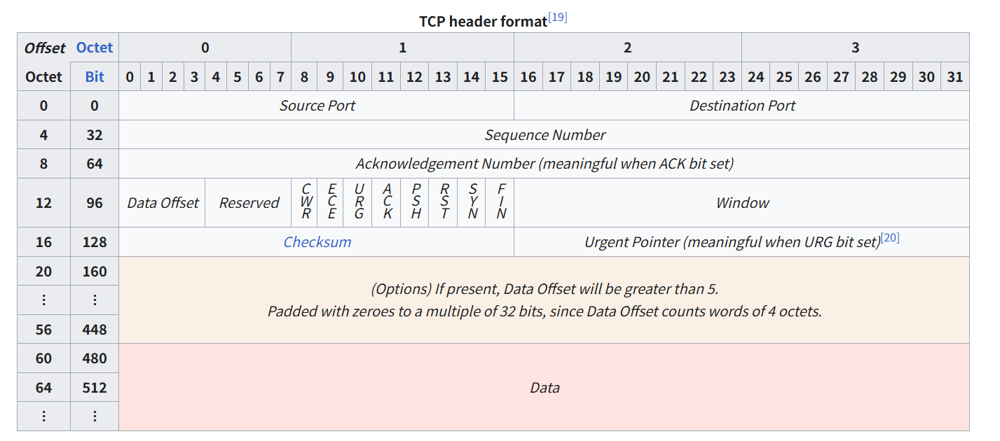

# 📅 TIL: 2026-01-31

## 📝 1. 오늘의 학습 주제 및 핵심 내용
- **주요 주제:** __TCP__




- **핵심 개념 1: TCP 3대 메커니즘** 
    - 흐름 제어 __(Flow Control): Window Size 필드__
    - 혼잡 제어 (__Congestion Control):__ 네트워크 전체의 막힘 정도에 따라 보내는 양 조절(네트워크 상황에 맞춤)
    - 오류 제어 __(Error Control)__: Sequence/ACK 번호와 Checksum을 이용(데이터의 정확성 보장)
- **핵심 개념 2: 주요 필드** 
    -  포트 주소 (Source & Destination Port, 각 16비트)
    - 순서 및 확인 응답 (Sequence & Acknowledgment Number, 각 32비트)
        - Sequence Number: 데이터 조각의 **'페이지 번호'** 
        - Acknowledgment Number : 확인 응답 번호 시퀀스 넘버 n번을 처리를 했으면 다음 처리할 시퀀스 넘버를 알리는 n + 1을 요구하게 되는 
        
- __핵심 제어 플래그 (Flags, 8비트)__  
- TCP의 상태(State)를 결정하는 8개의 플래그.

    - SYN (Synchronize): 연결 요청-동기화? 
    - ACK (Acknowledgment): 응답
    - FIN (Finish): 종료 요청
    - RST (Reset): 강제 종료 - 가장 많이 사용되는 방법이다
    - PSH (Push): 버퍼가 찰 때까지 기다리지 않고 실행해라
        - TCP는 버퍼링(Buffering) 메커니즘 사용한다 즉 버퍼가 있어서 버퍼가 다 차야지만 처리를 한다
        - 마지막에 온 패킷이 버퍼가 차지 않으면 전달을 하지 못한다 그래서 PSH 해당 플로그를 통해 처리한다
    - URG (Urgent): 긴급한 패킷이 있다고 알리는 플래그

 - 윈도우 크기 (Window, 16비트) - (흐름 제어) 
    - 수신 측은 TCP 헤더의 Window 필드를 통해서 자신의 남은 버퍼 공간을 송신 측에 업데이트해준다 - __window size__.
    - 수신자 측에서 조금씩 데이터를 받는 게 아니라 흐름제어(속도제어)를 하기 위해서 window size만큼 데이털르 늘려서 처리한다
    - 수신자가 허용한 만큼
  

 - **Urgent Pointer(긴급 포인터)**우선 권한을 부여하는 필드.
     - 체크섬 (Checksum, 16비트) : 헤더와 데이터가 전송 중에 깨지지 않았는지 검사한다.
    - 
- **핵심 개념 3:** 

---

## 💻 2. 실습 및 구현 내용
### ✅ 실습 목표
- 

### 🛠️ 구현 결과
```language
// 코드를 입력하세요
```

### ✨ 새롭게 알게 된 점
- 

---

## 🛠️ 3. 트러블슈팅 (Troubleshooting)
### 🔍 문제 발생 (Issue)
- **상황:** 
- **에러 메시지:** `Error`

### 💡 원인 분석 (Cause)
- 

### 🚀 해결 방법 (Solution)
- 

---

## 🧐 4. 오늘의 회고
### 💡 성찰 및 성장
- **습득 지식:** 
- **협업/소통:** 

### 🚀 Action Plan
- **부족한 점:** 
- **개선 방안:** 
- **내일의 목표:** 

---

## 📊 5. 메타인지 측정
### 🎯 오늘의 학습 점수
- **자기 객관화 점수:** ⭐ 0/10
- **이유:** 

---

### 🤝 공유 및 토론
- **참고 자료:** 
- **궁금한 점:** 