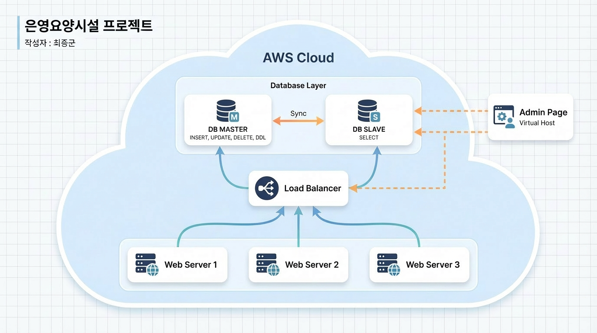

# 📅 개인 프로젝트 은영 진행 기록입니다
은영 프로젝트 기록입니다. 

### 📝 일별 리스트
- [2026-02-07: AWS Nginx 리버스 프록시를 활용한 보안 배포 및 인프라 구축](post.html?file=Feb/p-26-02-07.md)
- [2026-02-08: swap 활용 및 메인 페이지 수정](post.html?file=Feb/p-26-02-08.md)
- [2026-02-14 Docker DBeaver](post.html?file=Feb/p-26-02-14.md)
- [2026-02-14 보안 적용 DB](post.html?file=Feb/p-26-02-14v2.md)
- [2026-02-16 회원가입 및 로그인 기능 구현 및 정보 노출 최소화와 암호화 솔팅과 키 스트레칭)](post.html?file=Feb/p-26-02-16.md)
- [2026-02-16 Project Session vs Token[Session 선택 이유])](post.html?file=Feb/p-26-02-16v2.md)
- [2026-02-16 수동 세션 관리 방식에서 Spring Security로의 보안 프레임워크 전환)](post.html?file=Feb/p-26-02-16v3.md)
- [2026-02-16 은영 프로젝트 접근 제어 RBAC + ABAC 적용 및 취약점](post.html?file=Feb/p-26-02-16v4.md)
- [2026-02-18 도커 자체 배포](post.html?file=Feb/p-26-02-18.md)
- [2026-02-18 도커를 통한 AWS 배포](post.html?file=Feb/p-26-02-18v2.md)
- [2026-02-18 도커 자체 배포](post.html?file=Feb/p-26-02-18v3.md)
- [2026-02-18 도커 자체 배포 트러블 슈팅 2(빌드 파일(.jar))](post.html?file=Feb/p-26-02-18v3.md)
- [2026-02-18 도커 자체 배포 트러블 슈팅 3(빌드 파일(my-secure-oracle**의 상태 Exited (224)](post.html?file=Feb/p-26-02-18v4.md)

- [2026-02-21 은영 프로젝트 다중 컨테이너 환경 구성 (로드밸런싱) + dns 도메인 설정](post.html?file=Feb/p-26-02-21.md)
- [2026-02-22 은영 프로젝트 HTTPS(SSL/TLS) 프로토콜 도입을 통한 보안 인프라 구축](post.html?file=Feb/p-26-02-22.md)

--- 

## 은영 프로젝트아키텍처 구상도 ##

!

### 중요 내용 모음 

